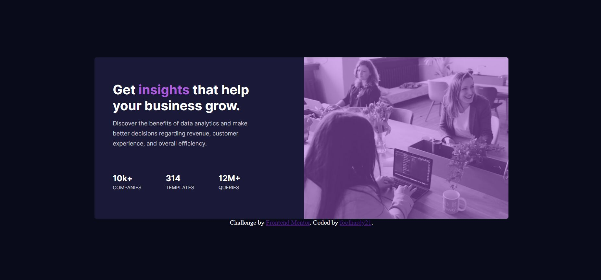

# Frontend Mentor - Stats preview card component solution

This is a solution to the [Stats preview card component challenge on Frontend Mentor](https://www.frontendmentor.io/challenges/stats-preview-card-component-8JqbgoU62). Frontend Mentor challenges help you improve your coding skills by building realistic projects.

## Table of contents

- [Overview](#overview)
  - [The challenge](#the-challenge)
  - [Screenshot](#screenshot)
  - [Links](#links)
- [My process](#my-process)
  - [Built with](#built-with)
  - [What I learned](#what-i-learned)
  - [Useful resources](#useful-resources)
- [Author](#author)
- [Acknowledgments](#acknowledgments)

**Note: Delete this note and update the table of contents based on what sections you keep.**

## Overview

### The challenge

Users should be able to:

- View the optimal layout depending on their device's screen size

### Screenshot

### Links

- Live Site URL: [Site](https://foolhardy21.github.io/stats-preview-card-component/)

## My process

### Built with

- Semantic HTML5 markup
- CSS custom properties
- Flexbox
- Media Query

### What I learned

I learnt the how a responsive site works by varying the viewport size. Along with this I learnt using images as an asset and using color gradient on top of it. Apart from this, I learnt the basics of Flex-Box.

### Useful resources

- [W3 Schools](https://www.w3schools.com) - This helped me in case of flex box properties and their values for aligning the content.
- [Stack Overflow](https://www.stackoverflow.com) - This helped as I could visit the solutions to similar doubts I had during the project.

## Author

- Frontend Mentor - [@foolhardy21](https://www.frontendmentor.io/profile/foolhardy21)

## Acknowledgments

I would like thank the resources mentioned because of which I could resolve my issues.
